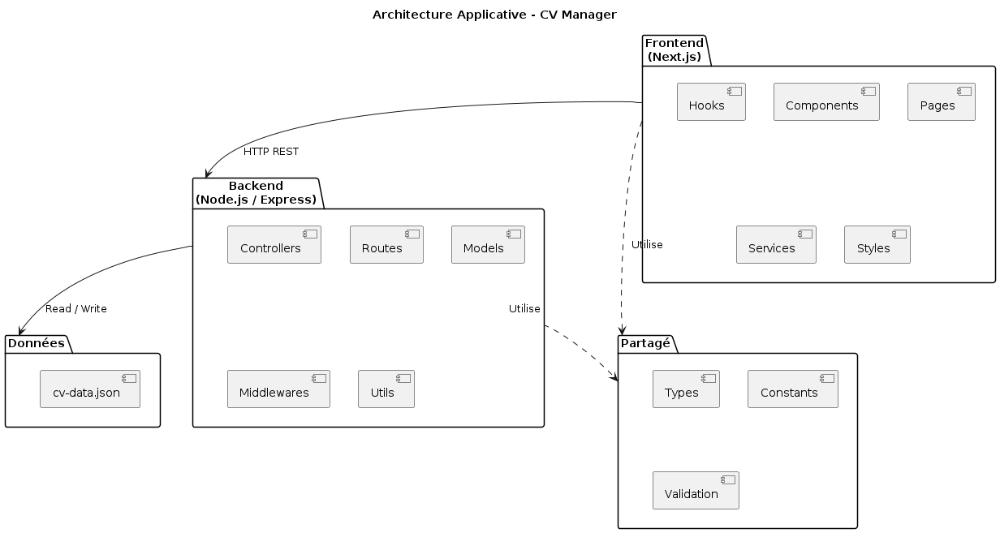
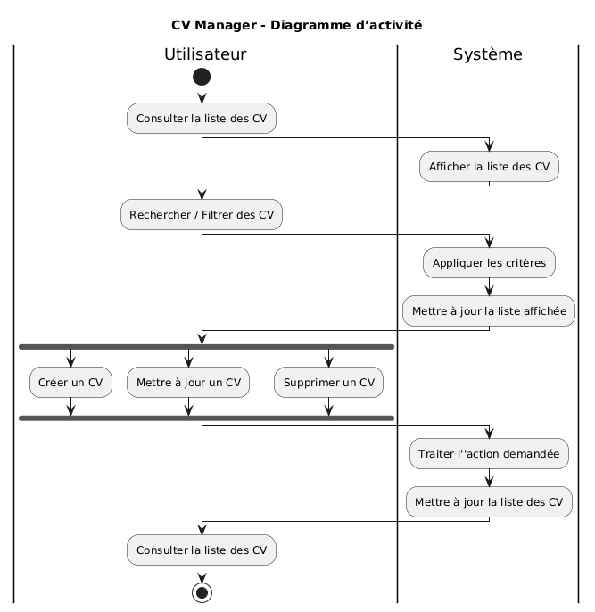
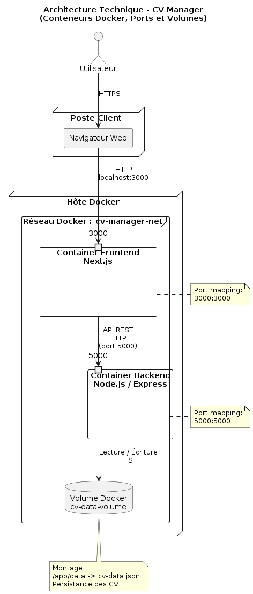

# CV Manager - Gestionnaire de CVs
=====================================

Ce projet est une application full-stack permettant de gérer des CVs stockés dans un fichier JSON.
Technologies utilisées : React, Next.js, Node.js et Express.

---

## Captures d'écran

### Page d'accueil (Liste des CVs)

*Affichage de tous les CVs avec filtres et recherche.*

### Formulaire de création/édition

*Interface pour ajouter/modifier les sections d'un CV.*

---

## Prérequis
- [Node.js](https://nodejs.org/) (version 16 ou supérieure)
- [npm](https://www.npmjs.com/) ou [yarn](https://yarnpkg.com/)
- Un éditeur de code (VSCode, Sublime Text, etc.)

---

## Installation
1. Cloner le dépôt :
```bash
git clone https://github.com/Champomix/cv-manager.git
cd cv-manager
```
2. Installer les dépendances du backend :
```bash
cd server
npm install express cors body-parser
```
3. Installer les dépendances du frontend :
```bash
cd ../client
npm install axios react-hook-form @hookform/resolvers yup
```
---

## Structure du projet
```
/cv-manager
├── client/          # Application Next.js (frontend)
├── server/          # API Node.js (backend)
└── cv-data.json     # Fichier de stockage des CVs (créé automatiquement)
```
---

## Lancement du projet
1. Démarrer le backend :
```bash
cd server
node index-datafile.js
```
(Accès : http://localhost:5001)

2. Démarrer le frontend :
```bash
cd ../client
npm run dev
```
(Accès : http://localhost:3000)

---

# Architecture du projet CV Manager

Ce document décrit les trois niveaux d'architecture du projet **CV Manager** : fonctionnelle, applicative et technique.

---

## 1. Architecture Fonctionnelle

**Objectif :** Représenter les processus métiers et les interactions utilisateur.



### Acteurs :
- **Utilisateur** : accède à l'application via un navigateur et effectue des actions sur les CVs.

### Activités principales :
- **Consulter la liste des CVs**  
  - Point d’entrée principal pour l’utilisateur.  
  - Permet d’appliquer des filtres ou de rechercher des CVs.
- **Filtrer/Rechercher**  
  - Sous-processus de `Consulter la liste des CVs`.  
  - Permet de retrouver rapidement des CVs selon critères (compétences, expérience, etc.).
- **Créer un nouveau CV**  
  - Crée un CV avec saisie des informations de manière générique (infos personnelles, expériences, formation, compétences).
- **Mettre à jour un CV**  
  - Éditer un CV existant sans affecter la suppression.  
- **Supprimer un CV**  
  - Supprime un CV existant.  
- **Exporter en PDF**  
  - Génère une version PDF du CV.

### Remarques importantes :
- Les tâches **Créer**, **Mettre à jour** et **Supprimer** sont de même niveau et peuvent être effectuées indépendamment.
- La sous-activité **Filtrer/Rechercher** est incluse dans la tâche **Consulter la liste des CVs**.
- Les flux sont déclenchés par l’utilisateur mais restent indépendants, aucune séquence obligatoire entre création, modification ou suppression.

---

## 2. Architecture Applicative

**Objectif :** Montrer l’organisation logique du code et les dépendances entre composants.



### Packages principaux :

| Couche        | Description |
|---------------|------------|
| **Frontend (Next.js)** | Contient les composants UI, pages, hooks, services et styles. Communique avec le backend via requêtes HTTP. |
| **Backend (Node.js/Express)** | Contient les contrôleurs, routes, modèles, middlewares et utilitaires. Traite les requêtes du frontend et accède aux données. |
| **Données (JSON)** | Stockage local des CVs via `cv-data.json`. |
| **Partagé (Shared)** | Types, constantes et validations utilisées par le frontend et le backend. |

### Dépendances :
- Frontend → Backend : Requêtes HTTP (REST API)
- Backend → Data : Lecture/Écriture sur fichier JSON
- Frontend et Backend → Shared : Réutilisation de types et fonctions utilitaires (dépendances de code)

---

## 3. Architecture Technique

**Objectif :** Décrire l’infrastructure de déploiement avec conteneurs Docker et volumes persistants.



### Conteneurs principaux :

| Composant           | Image Docker       | Ports  | Description |
|--------------------|-----------------|--------|------------|
| **Frontend**        | node:16          | 3000   | Application Next.js. Serveur web côté client. |
| **Backend**         | node:16          | 5001   | API Express.js. Traite les requêtes HTTP et accède au stockage des CVs. |
| **Volume Docker**   | -                | -      | Persistance des fichiers JSON de données. |

### Mapping des ports :
- Navigateur → Frontend : HTTPS (port 3000)
- Frontend → Backend : HTTP REST API (port 5001)
- Backend → Volume Docker : Montage du fichier JSON (persistance)

---

## Notes Générales

- **Flux de données** : Navigateur ↔ Frontend ↔ Backend ↔ Données
- **Indépendance des tâches fonctionnelles** : création, mise à jour et suppression ne sont pas séquentielles.
- **Séparation des responsabilités** : chaque couche applicative a une fonction distincte pour faciliter la maintenance et l’évolution.


## Structure des données (cv-data.json)
Exemple de format :
```json
{
  "cvs": [
    {
      "id": "1625097600000",
      "personalInfo": {
        "firstName": "Jean",
        "lastName": "Dupont",
        "email": "jean@example.com"
      },
      "experiences": [
        {
          "company": "Tech Corp",
          "position": "Développeur Senior",
          "startDate": "2020-01",
          "endDate": "Présent"
        }
      ],
      "educations": [
        {
          "institution": "Université ParisTech",
          "degree": "Master en Informatique",
          "startDate": "2015-09",
          "endDate": "2017-06"
        }
      ],
      "skills": ["JavaScript", "React", "Node.js"],
      "createdAt": "2021-06-30T12:00:00.000Z",
      "updatedAt": "2021-07-15T09:30:00.000Z"
    }
  ]
}
```

---

## Endpoints API
- GET    /api/cvs        : Liste tous les CVs
- GET    /api/cv/:id     : Récupère un CV spécifique
- POST   /api/cv         : Crée ou met à jour un CV
- DELETE /api/cv/:id     : Supprime un CV

---

## Améliorations possibles
- Authentification (next-auth)
- Upload de fichiers (multer)
- Export PDF (jspdf)
- Base de données (mongoose)
- Tests (Jest)

---

## Résolution des problèmes
- Backend ne démarre pas : Vérifiez que le port 5001 est libre
- Erreur CORS : Activez le middleware cors() dans server/index.js
- Modifications non sauvegardées : Vérifiez les permissions du fichier cv-data.json

---

## Docker
### 1. Build des images
    docker-compose build

### 2. Lancement des conteneurs
    docker-compose up -d

### 3. Arrêt
    docker-compose down

### 4. Publication (DockerHub)
    docker login
    docker tag cv-manager-backend fjuillet/cv-manager-backend:latest
    docker tag cv-manager-frontend monuser/cv-manager-frontend:latest
    docker push fjuillet/cv-manager-frontend:latest
    docker push fjuillet/cv-manager-backend:latest

## Licence
Ce projet est sous licence MIT.
